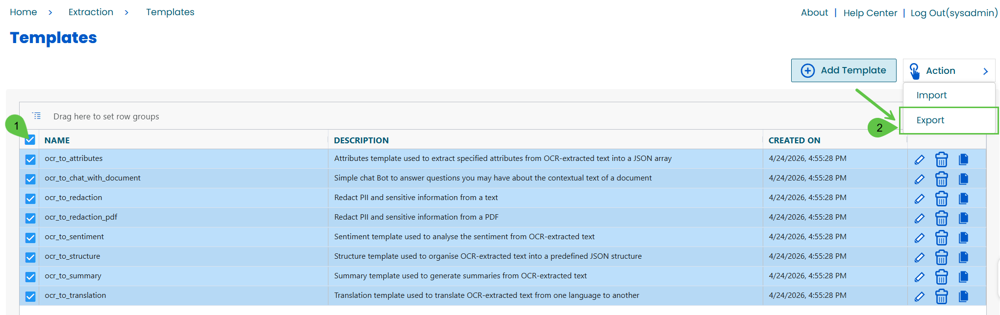
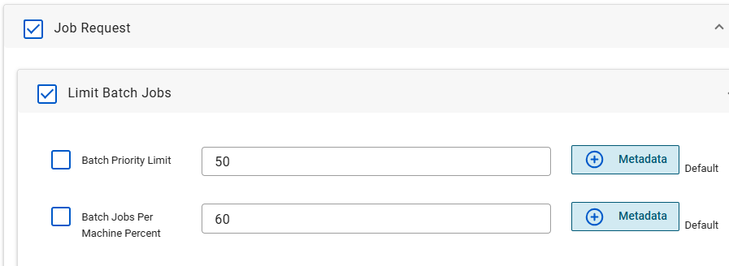

# AWAITING REVIEW Enhancements & Updates 2026.1

Transform 2026.1 includes improvements that make existing functionality easier to use, more efficient, and more reliable. These updates focus on simplifying common tasks, reducing manual effort, and improving how you manage jobs, models, and system behavior.

# **User Experience and Administration Improvements**

Transform 2026.1 introduces numerous UX updates to improve usability and optimize workflows.

## Why this enhancement matters

Managing jobs, reviewing results, and testing configurations should be quick and straightforward. These updates reduce the number of steps required and make key information easier to access.

## What’s improved

Several updates make it easier to submit jobs, review results, and manage models.

- Improved job upload experience:
  - Submit primary files, supporting files, and metadata in a single step
  - Reduces the need for multiple uploads or manual configuration
- File Metadata tab:
  - View metadata directly in the interface without opening job files
  - Available across different job states, including completed and failed jobs
- Persistent grid settings:
  - Your table views and preferences are saved across sessions
  - Reduces repeated setup when navigating between pages
- Job retry capability:
  - Retry jobs without re-uploading files
  - Speeds up testing and troubleshooting
- Improved model management interface:
  - Easier to find, organize, and manage models
  - Supports faster navigation and updates

## What this means for you

- You spend less time navigating between pages and repeating steps
- You can test and troubleshoot jobs more quickly
- You can access important information without digging through job data
- You can develop Workflows without repeated job ingestion cycles for files

## Background

These updates simplify common tasks such as uploading files, reviewing results, and managing models, reducing manual effort and improving day-to-day usability.

# **Model Management Enhancements**

Model management has been improved to make it easier to organize, reuse, and maintain models as your configurations grow.

## Why this enhancement matters

Managing models should be simple and intuitive, especially when working with multiple configurations. These updates make it easier to find, organize, and reuse models.

## What’s improved

Several updates improve how models are managed and maintained.

- Output Definitions are now called Models:
  - Provides clearer, more consistent terminology
  - Aligns with how models are created and used
- Bulk import and export:
  - Import or export multiple models at once
  - Makes it easier to move models between environments or back up configurations
- Category filtering:
  - Organize models by category
  - Quickly find the models you need
- Clone and edit functionality:
  - Duplicate existing models to reuse configurations
  - Make changes without starting from scratch

## What this means for you

- You can manage models more efficiently as your library grows
- You can reuse existing work instead of rebuilding configurations
- You can quickly find and update the models you need

## Background

These updates improve how models are organized and managed, making it easier to work with multiple models and maintain consistency across configurations.

# LLM Request Round-Robin

A round-robin LLM request approach improves scalability for high-volume AI processing by distributing requests across multiple deployments of the same model.

## Why this enhancement matters

Large document processing and high-volume extraction workloads can exceed the token-per-minute limits of a single LLM deployment. When this happens, requests may be delayed or rejected by the provider.

LLM request round-robin helps reduce this bottleneck by spreading requests across multiple model endpoints, allowing Transform to process more documents without relying on a single deployed model instance.

## What’s improved

You can now configure multiple provider endpoints for the same LLM model.

LLM request round-robin:

- Supports multiple deployments of the same model
- Distributes requests across configured model instances
- Helps reduce token-per-minute throttling
- Supports higher throughput for large-scale extraction workloads
- Can support deployments across regions when configured

## What this means for you

- You can scale LLM processing more effectively for enterprise workloads
- You can reduce delays caused by provider rate limits
- You can process higher document volumes without depending on a single model endpoint
- You can support larger customers and high-throughput use cases more reliably

## Background

LLM providers often limit the number of tokens a single deployed model can process per minute. For customers processing thousands of documents or running complex extraction workloads, a single model deployment may not provide enough throughput.

LLM request round-robin addresses this limitation by allowing Transform to route requests across multiple deployments of the same model. This improves throughput and helps support enterprise-scale AI extraction workloads.

# **Platform and API Enhancements**

Platform and API updates improve how Transform integrates with external systems while strengthening security and compatibility with modern AI services.

## Why this enhancement matters

Secure and reliable integrations are critical when connecting Transform to external systems and AI services. These updates ensure that data access is controlled and that integrations remain compatible with evolving AI platforms.

## What’s improved

Key updates strengthen security and improve compatibility with supported AI services.

- Full API authorization:
  - All API endpoints now require proper authorization
  - Helps protect access to data and system operations
- Migration to the Responses API for supported models:
  - Aligns with updated AI provider standards
  - Ensures continued compatibility with supported models

## What this means for you

- Your integrations are more secure and better protected
- You can continue using supported AI models without disruption
- Your system remains aligned with current platform standards

## Background

These updates improve how Transform communicates with external systems and AI providers, ensuring secure access and ongoing compatibility as underlying technologies evolve.

# **Engine Configuration Enhancements**

## **Why this enhancement matters**

When your system is processing many documents at once, not all jobs are equally important. Some need to run immediately, while others can wait. These new settings help you control how your system prioritizes work so that important jobs are not delayed by lower-priority ones.

## **What’s new**

You can now control how many system resources are used for lower-priority jobs. For example:

**LimitBatchJobs**  
Lets you limit the number of lower-priority jobs that can run simultaneously on a machine.

**BatchPriorityLimit**  
Defines what counts as a lower-priority job. Any job with a value at or above this threshold is treated as a batch (lower-priority) job.

**BatchJobsPerMachinePercent**  
Lets you control how much of your system is allowed to process lower-priority jobs.

Example:  
If you have 5 engines and set `BatchJobsPerMachinePercent` to 40%, only 2 engines will process lower-priority jobs. The remaining 3 engines stay available for higher-priority work

**Scaler Settings Update**  
Scaling settings have moved out of the Transformation Engine and are now managed in System Manager.

## **What this means for you**

These settings directly affect how quickly high-priority jobs start processing. Without these settings, lower-priority jobs can take up all available resources, and important jobs may be forced to wait.

**Note**: Your system behaves differently depending on whether the cache is enabled. Ensure that your cache is disabled to support system resource control.