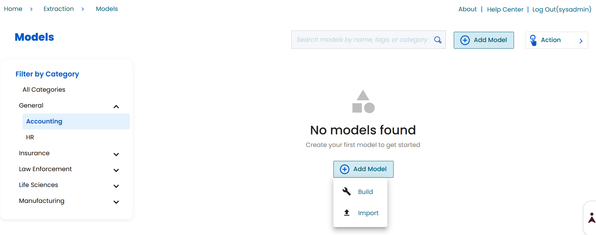
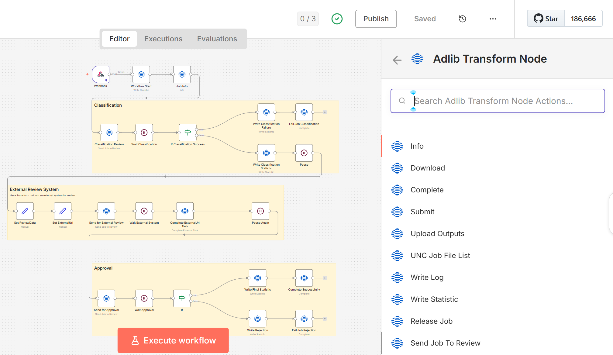
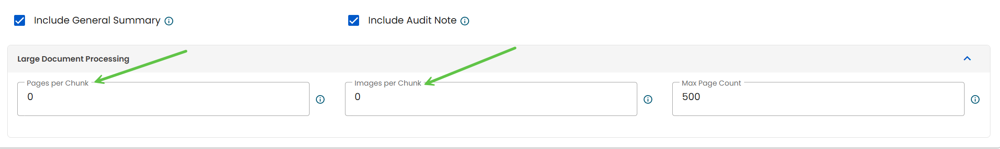
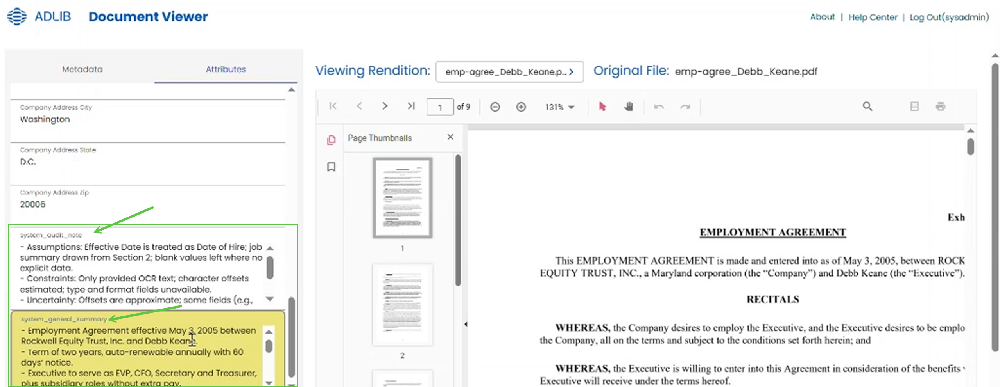
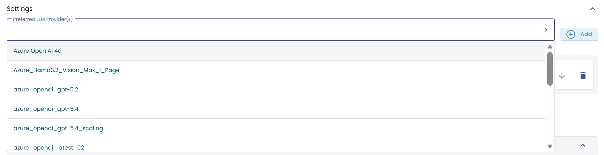
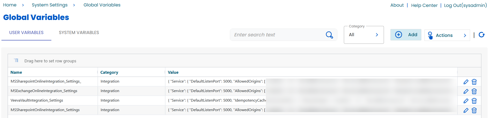
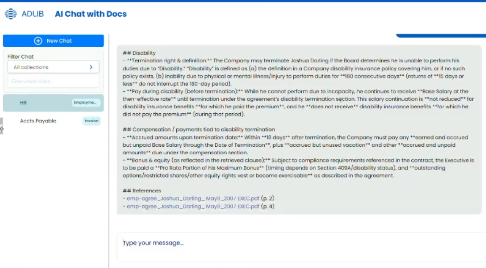

# AWAITING REVIEW New Features 2026.1

Transform 2026.1 introduces new capabilities that make it easier to build data extraction models, process documents, and work with AI-generated results. These features are designed to reduce manual effort, improve visibility into how results are generated, and give you more control over how your workflows run.

The sections below highlight what’s new and explain how each feature helps you work more efficiently, validate results with confidence, and scale your document processing more effectively.

# Model Builder

The Model Builder is a redesigned way to create, test, and manage extraction models in Transform. Instead of configuring models across multiple pages and steps, you can now build and test a model in a single, guided workflow!

Start by uploading a sample document. Then, the system analyzes it and generates a starting model, including suggested fields and settings. You can then test the results immediately, make changes, and refine the model without leaving the page.

In simple terms, it replaces a manual, multi-step setup process with a faster, more streamlined experience that helps you get to a working model more quickly.

## Why this feature matters

Previously, creating a model required moving between multiple pages to define fields, configure rules, upload files, and review results. This made testing slow and difficult, especially during model refinement. The new Model Builder brings all of this into one place.

## What’s new

You can now create and test a model in a single workflow.

- Upload a sample document to start building a model
- The system analyzes the document and automatically:
  - Suggests a model name, description, and category
  - Detects fields and creates an initial extraction structure
- Run a test extraction directly in the same screen
- Compare results when using multiple models
- Edit fields, configuration, and settings without leaving the page
- Save models in draft mode and enable them when ready

You can also:

- Import existing models
- Clone models
- Search and filter models by category and tags

## What this means for you

- You no longer need to switch between pages to build and test a model
- You get a working starting point instead of building everything manually
- You can test and refine models faster

## Background

The Model Builder analyzes the document you provide and generates a starting configuration. This replaces the previous process of manually defining fields, configuring rules separately, and repeatedly uploading files to test results.

# Human-in-the-Loop (HITL) Workflow Enhancements

Transform 2026.1 expands Human-in-the-Loop capabilities, allowing you to add human input directly into automated workflows. This means you can pause a process at key points to review, approve, or update information before it continues, giving you more control over how decisions are made during processing rather than only after results are produced.

## Why this feature matters

Some business processes require human judgment before work can continue. A user may need to classify a document, approve a result, enter additional information, or complete a review in another system. Transform 2026.1 allows these decision points to be incorporated into the workflow rather than handled outside the automated process.

## What’s new

You can now include human input steps in a workflow using Adlib Transform Node actions in n8n. These steps pause the workflow and require input before continuing.

Some of the available supported actions include:

- Approval
- Data entry
- External URL actions

Once the required action is completed, the workflow resumes automatically.

## What this means for you

- You can require decisions or input at specific points in a workflow
- You can collect or correct data during processing
- You can control how and when a process continues

## Background

Workflows can now pause at defined steps and wait for user input. After the input is provided, the workflow continues from that point.

# Large Document Processing (Chunking and Stitching)

Transform 2026.1 introduces the ability to process large documents that would previously exceed system limits by automatically breaking them into smaller sections and combining the results into a single output. This allows you to work with longer, more complex documents without failures, while still receiving a single, complete, consistent result.

## Why this feature matters

Some AI models can process only a limited amount of content at a time. Large documents may fail or produce incomplete results when they exceed these limits. This feature lets you process large documents without hitting those limits.

## What’s new

Large documents are now processed in smaller sections, then combined into a single result.

- Documents are automatically split into smaller parts that fit within processing limits
- Each part is processed separately
- All results are combined into one output
- The entire process is treated as a single job

This means you do not need to manage multiple jobs or partial results.

## What this means for you

- You can process large and complex documents that were previously difficult or impossible to handle
- You get a single, complete result even though the document is processed in parts
- You reduce failures caused by size limits

## Background

When a document is too large to process at once, the system breaks it into smaller sections that can be handled individually. Each section is processed, and the results are combined into a single output. This approach allows the system to operate within the model’s limits while still producing a complete result.

# AI Extraction Auditability Enhancements

Transform 2026.1 enhances AI extraction results by providing additional context to help you understand, review, and validate outputs with greater confidence.

## Why this feature matters

AI extraction can return results without clearly showing how those results were determined. This makes validation and review more difficult. These enhancements provide additional context to help you better understand and verify extraction results.

## What’s new

In the Document Viewer, extraction results now include additional audit information to support review and validation.

- A general summary of the document
- Audit notes that describe the extraction context and observations
- When multiple possible values are detected for a field, all values are shown

If multiple values are found, the job can be reviewed using Human-in-the-Loop, where you can:

- Select the correct value
- Enter a corrected value if needed

## What this means for you

- You can understand what was extracted without reviewing the entire document
- You can identify and resolve ambiguous results more easily
- You can validate outputs before they move to downstream processes

## Background

Additional audit information is generated as part of the extraction output. This helps explain results and supports review workflows, especially when multiple possible values are detected.

# Expanded Multi-Provider Model Support

Transform 2026.1 expands and streamlines model selection, giving you greater flexibility to choose and switch between AI models based on your specific performance, cost, and use-case needs.

## Why this feature matters

Different AI models vary in cost, performance, and capabilities. Choosing the right model for each use case helps you balance accuracy, speed, and cost. This release expands the range of models you can use and simplifies how you work with them.

## What’s new

Model support has been expanded and made easier to manage.

- Access models from:
  - Azure Foundry
  - AWS Bedrock
  - Google Vertex AI
- Use both commercial and open-source models
- Switch between models without changing your workflow configuration
- Connect to multiple model providers through a single integration layer

## What this means for you

- You have more options when selecting models for your documents
- You can test and compare models more easily
- You can adjust model usage without rebuilding your workflows

## Background

Transform connects to multiple model providers via a single integration layer, enabling you to use different models without changing your workflow configuration.

# Integration Plugin Framework

Transform 2026.1 introduces a more flexible integration approach that makes it easier to add, update, and manage connectors without impacting the core system.

## Why this feature matters

Previously, connectors were built into the core system. This made them harder to update, test, or replace, and adding new integrations often required more effort and time. This release introduces a more flexible approach to building and managing integrations.

## What’s new

Connectors are now built as independent plugins.

- Connectors can be developed and updated without changing the core system
- Setup is driven by configuration instead of manual registration
- Connectors communicate with Transform using standard APIs
- Designed to handle high volumes of documents

## What this means for you

- New integrations can be added more quickly
- Existing connectors are easier to update and maintain
- You can manage integrations without modifying the core application

# AI RAG (Hybrid Search with Citations)

Transform 2026.1 enhances document search by combining multiple data types and providing cited, traceable answers, making it faster and easier to find and verify information across documents.

## Why this feature matters

Finding information across many documents can be slow and difficult, especially when answers depend on both text and data extracted from documents, including scanned or image-based files.

These enhancements improve how information is retrieved and presented, so you can get accurate answers more quickly.

## What’s new

AI RAG now uses a hybrid search approach and provides traceable, structured responses.

- Retrieves information from:
  - Document text, including text extracted from scanned or image-based documents
  - Extracted structured data (for example, fields and tables)
  - Document metadata
- Provides responses with citations showing:
  - Which documents were used
  - Where the information was found
- Supports more advanced questions, including:
  - Queries across multiple documents
  - Questions based on tables or extracted values
  - Basic aggregations such as totals or comparisons
- Maintains short-term context for follow-up questions within a session
- Displays responses in a more structured and readable format

Selecting a citation takes you to the relevant content for review.

## What this means for you

- You can find information in both text-based and scanned documents
- You can trust the results because they are tied to Source content
- You can ask more complex questions, including those based on extracted data
- You can quickly verify results without manually searching documents

## Background

Documents are processed to extract text, including from scanned or image-based content, and enriched with structured data and metadata. When you ask a question, the system retrieves relevant content and generates a response based on that information.